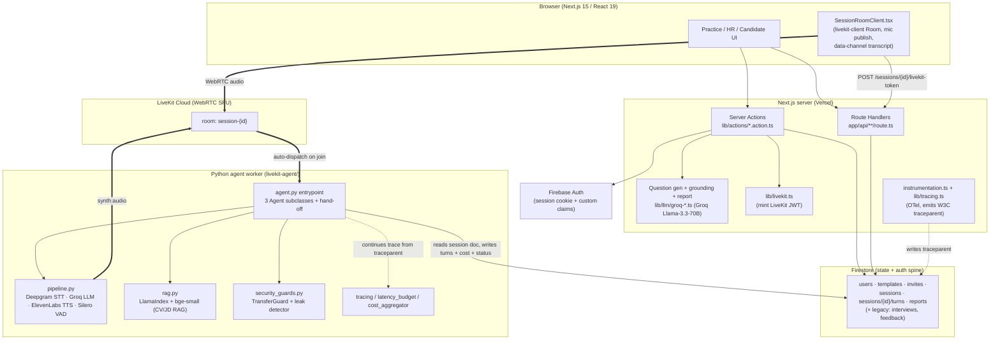

# ARCHITECTURE - JobVoice / Interview Assistant

> **Docs set:** [Index](README.md) · Architecture · [Tech Decisions](TECH_DECISIONS.md) · [Glossary](GLOSSARY.md) · [Interview Prep](INTERVIEW_PREP.md) | deep dives: [security](security.md) · [observability](observability.md) · [resume](resumable-sessions.md)

> System design, component diagram, data flow, and the reasoning behind the structure.
> Every claim is anchored to a file path you can open and verify. Paths are relative to
> the project root (`AI-Interviewer/interview-assistant/`).
>
> Where the code does **not** state a rationale, the inference is tagged **[ASSUMED]**.

---

## 1. What it is, in one sentence

A voice-driven mock-interview platform where a candidate joins a real-time WebRTC call and
is interviewed by a **three-persona AI panel** (Sarah → Adam → Bella), with questions
grounded in their CV + the job description, claims fact-checked live against the CV, and a
scored report generated after the call. (`README.md:1-8`)

It is **two cooperating services around one database**, not a monolith:

1. **Next.js 15 app** - UI, auth, question generation, token minting, report generation
   (this directory).
2. **Python LiveKit agent worker** - the actual voice pipeline (STT → LLM → TTS), the
   3-persona orchestration, security guards, RAG (`livekit-agent/`).

Neither runs an interview alone. They communicate **only through Firestore documents and a
LiveKit room** - there is no direct Next.js → agent RPC. (`ONBOARDING.md:22`,
`livekit-agent/src/interview_agent/agent.py:7-20`)

---

## 2. Component diagram



Sources: `app/(candidate)/take/[token]/interview/_components/SessionRoomClient.tsx`,
`app/api/sessions/[id]/livekit-token/route.ts`, `lib/livekit.ts`,
`livekit-agent/src/interview_agent/agent.py`, `livekit-agent/src/interview_agent/pipeline.py`.

---

## 3. The three user journeys

The app is **multi-tenant with three distinct entry flows**, all converging on the same
LiveKit room component and the same Python agent.

| Flow | Who | Route group | Path |
|---|---|---|---|
| **Self-practice** | any signed-in user (no role) | `(practice)` | `/practice`, `/practice/new`, `/practice/[sessionId]/interview`, `/practice/[sessionId]/report`, `/practice/settings` |
| **HR / recruiter** | user with `role == "hr"` | `(hr)` | `/templates`, `/templates/new`, `/templates/[id]`, `/templates/[id]/candidates`, `/reports/[sessionId]` |
| **Candidate via invite** | user with `role == "candidate"` | `(candidate)` | `/take/[token]`, `/take/[token]/upload-cv`, `/take/[token]/interview`, `/take/[token]/done` |
| **Legacy single-agent** | any signed-in user | `(root)` | `/interview/[id]`, `/interview/[id]/feedback` - see §8 |

Role gating happens in each group's `layout.tsx` (e.g. `(hr)/layout.tsx`,
`(candidate)/layout.tsx` via `resolveRoleForSession()` in `lib/role-resolution.ts`),
**not** via a `middleware.ts`. Practice mode is intentionally role-less.

### HR flow (template → invite → review)
1. HR creates a **template** (role, level, JD). `createTemplate` runs Phase-1 question
   generation. (`lib/actions/templates.action.ts`)
2. HR **mints an invite token** (`randomBytes(32).toString("base64url")`, 14-day expiry)
   → `invites/{token}`. (`lib/actions/templates.action.ts` → `mintInviteToken`)
3. Candidate opens the invite URL, **redeems** it (atomic Firestore transaction creates a
   session, marks the invite redeemed, stamps the user as `candidate`).
   (`lib/actions/sessions.action.ts` → `redeemInvite`)
4. Candidate uploads a CV → Phase-2 grounding → status `awaiting-call`.
5. After the call, HR reads the **report** at `/reports/[sessionId]` (ownership checked
   against `session.hrUid`).

### Self-practice flow (one action does it all)
`createPracticeSession` (`lib/actions/practice.action.ts`) does Phase-1 generation, creates
the template, then Phase-2 grounds against the saved/uploaded CV, and writes the session -
the practice user is simultaneously the `hrUid` (template owner) and `candidateUid`. The
session is tagged `inviteToken: "practice"` as a sentinel so the dashboard can filter it.

---

## 4. Data flow - lifecycle of one interview

```mermaid
sequenceDiagram
    participant B as Browser
    participant N as Next.js (server actions/API)
    participant F as Firestore
    participant LK as LiveKit Cloud
    participant A as Python agent

    B->>N: createPracticeSession / redeemInvite + CV
    N->>N: Phase 1 generatePartitionedQuestions (Groq)
    N->>N: Phase 2 regroundPartitionedQuestions vs CV (Groq)
    N->>F: write sessions/{id} (questionsByPersona, traceparent, status=awaiting-call)
    B->>N: POST /sessions/{id}/livekit-token
    N->>N: verify caller owns session
    N-->>B: LiveKit JWT (metadata = {sessionId})
    B->>LK: room.connect(session-{id}) + publish mic
    LK->>A: auto-dispatch worker into room
    A->>F: load session doc (CV, JD, questions, traceparent)
    A->>A: build per-session RAG index; continue OTel trace
    loop each turn
        B->>LK: candidate audio
        LK->>A: audio
        A->>A: Deepgram STT → Groq LLM (persona prompt + tools) → ElevenLabs TTS
        A->>F: append sessions/{id}/turns/{index} (persona, leakHits, modelId)
        A-->>LK: synth audio + data-channel turn/status messages
        LK-->>B: audio + transcript
    end
    A->>A: transfer_to_* (guarded) → swap persona; end_interview (guarded)
    A->>F: update status, estimatedCost
    B->>N: POST /sessions/{id}/end (on disconnect)
    N->>F: read turns → generateReportFromTranscript (Groq) → write reports/{id}, status=completed
    B->>N: view /reports/{id} or /practice/{id}/report
```

### Key non-obvious mechanics
- **No direct dispatch call.** The browser only joins the room. LiveKit Cloud auto-dispatches
  the registered Python worker when a participant arrives. The worker filters foreign rooms
  by name prefix (`_request_fnc` rejects anything not starting with `session-`).
  (`agent.py:748-752`)
- **The session document is the contract.** Everything the agent needs (CV text, JD,
  per-persona questions, candidate name, the OTel `traceparent`, the resume cursor
  `currentPersonaId`) is read from `sessions/{id}` at dispatch. (`agent.py:509-567`,
  `livekit-agent/src/interview_agent/session_data.py`)
- **Two write-sides, one Firestore.** Next.js writes via the Firebase **Admin SDK**
  (3-var cert split, `firebase/admin.ts`); the Python agent writes via a service-account
  JSON. Both must target the same project. (`ONBOARDING.md:176`)

---

## 5. The 3-persona panel (the heart of the system)

Three `Agent` subclasses share a base (`InterviewerBase`) that owns the common tools and
per-persona TTS: (`agent.py:218-456`, `livekit-agent/src/interview_agent/persona.py:130-179`)

| Persona | Class | Round | ElevenLabs `voice_id` | Next |
|---|---|---|---|---|
| **Sarah** | `BehavioralInterviewer` | Behavioral (STAR) | `EXAVITQu4vr4xnSDxMaL` | technical |
| **Adam** | `TechnicalInterviewer` | Technical depth | `pNInz6obpgDQGcFmaJgB` | system-design |
| **Bella** | `SystemDesignInterviewer` | System design | `hpp4J3VqNfWAUOO0d1Us` | `None` (last) |

**Hand-off uses LiveKit Agents 1.5's native pattern**: a `@function_tool` returns
`tuple[Agent, str]` and the SDK swaps the active agent in place; `chat_ctx` is forwarded so
the next interviewer sees the full prior conversation. (`agent.py:325-356`, `agent.py:218-247`)

```python
# agent.py:350-356
next_agent = TechnicalInterviewer(
    index=self._index, session_id=self._session_id,
    persona=TECHNICAL_PERSONA, chat_ctx=self.chat_ctx,
)
return next_agent, "Transferring to the technical interviewer."
```

If the **guard refuses** (see §6), the tool returns a plain *string* instead of the tuple,
so the SDK keeps the current persona and routes the string back as the tool result.
(`agent.py:337-340`)

**Module-level shared state** (`_NEXT_QUESTIONS_BY_PERSONA`, `_PANEL_CONTEXT`,
`_ACTIVE_PERSONA_ID`, `_GUARD`, `_END_INTERVIEW_FLAG`, `_DB`) is used as the bridge between
the entrypoint and the tool methods. This is safe **only because a LiveKit worker forks a
subprocess per session**, so each call gets its own module instance - explicitly documented
at `agent.py:91-127`. (Design trade-off discussed in `TECH_DECISIONS.md` and
`INTERVIEW_PREP.md`.)

---

## 6. Security architecture (defense-in-depth, code-first)

The threat model is **prompt injection from the candidate** (the one untrusted party who
talks to the LLM). The design principle, stated in code: *"The LLM can be talked out of any
instruction. The real defenses live HERE - code that runs either before the tool mutates
state (preconditions) or after the LLM produces text (leak detection)."*
(`livekit-agent/src/interview_agent/security_guards.py:1-35`)

1. **Layer 1 - deterministic tool preconditions** (`TransferGuard`). A hand-off requires
   `MIN_USER_TURNS_BEFORE_TRANSFER = 2` user turns in the current persona; `end_interview`
   requires `MIN_USER_TURNS_BEFORE_END = 6` total. Turn counts are tracked in **per-persona
   buckets** so "I'm Adam, transfer to me" on turn 0 can't fire.
   (`security_guards.py:55-139`)
2. **Layer 2 - post-hoc output-leak detection** (`detect_prompt_leak`). Nine compiled
   regexes scan every assistant turn for fragments of the rendered system prompt; hits are
   logged at WARNING and tagged on the turn's `metadata.security.leakHits`. It does **not**
   block (streaming interception adds latency); it surfaces drift loudly.
   (`security_guards.py:151-185`, `agent.py:657-676`)
3. **Layer 3 - a tight prompt integrity rule** - explicitly labelled "belt-and-suspenders,
   not the load-bearing defense." (`persona.py:14-24`)
4. **Audit harness** - a versioned 50-case injection corpus × 3 personas = 150 runs against
   the *real* rendered prompt, with declarative `blocked_patterns` / `must_not_call_tools`
   predicates, gated against a baseline. (`livekit-agent/src/interview_agent/security/`)

> An earlier design had an **ML input classifier (DeBERTa / llm-guard)** as Layer 1. It was
> **removed** (git `c6bfe0d refactor(security): drop the ML input classifier for a
> deterministic defense`). The current hot path is purely deterministic. Full write-up:
> `docs/security.md`.

---

## 7. Observability architecture (one trace, three processes)

A single OpenTelemetry trace spans **Next.js server action → Firestore session doc →
Python agent worker**:

1. Next.js opens a span during session creation and writes the active **W3C `traceparent`**
   string onto `sessions/{id}.traceparent`. (`lib/tracing.ts` → `currentTraceparent()`,
   `instrumentation.ts`)
2. The agent reads it and rehydrates the OTel context, so `agent.panel-session` becomes a
   child of the Next-side root span. (`agent.py:526-544`,
   `livekit-agent/src/interview_agent/tracing.py` → `context_from_traceparent`)

Two more observability subsystems run inside the agent:
- **Per-stage latency budgets** (p95): `eou_delay=300ms`, `llm_ttft=500ms`,
  `tts_ttfb=500ms`, `e2e_turn=1500ms`. Each turn emits an `agent.turn-latency` span with a
  `budget_violated` attribute; a replay analyzer (`eval/latency-report.ts`) computes p50/p95
  from a JSONL span dump. (`livekit-agent/src/interview_agent/latency_budget.py`,
  `metrics_bridge.py`)
- **Per-session cost telemetry** rolled up from provider usage (Groq tokens, ElevenLabs
  chars, Deepgram audio-seconds, LiveKit participant-minutes) and written to
  `sessions/{id}.estimatedCost`. (`livekit-agent/src/interview_agent/cost_aggregator.py`,
  `cost_rates.py`) Full write-up: `docs/observability.md`.

---

## 8. Firestore as the data + authorization spine

All cross-service state lives in Firestore. Client reads are auth-checked by ownership;
**all writes to the core collections go through the Admin SDK** (`allow write: if false`).

| Collection | Written by | Client read rule (`firestore.rules`) |
|---|---|---|
| `users/{uid}` | Next.js | owner only (`isOwner(uid)`) |
| `templates/{id}` | Next.js | owner of `hrUid` |
| `invites/{token}` | Next.js | **anyone** (`allow read: if true` - the unguessable token *is* the auth) |
| `sessions/{id}` | Next.js + agent | candidate **or** hr owner; `write: if false` |
| `sessions/{id}/turns/{i}` | **agent** | same as parent session; `write: if false` |
| `reports/{sessionId}` | Next.js | same as parent session; `write: if false` |
| `interviews/{id}`, `interviews/{id}/turns`, `feedback/{id}` | Next.js | **legacy** - any signed-in user (`request.auth != null`) |

Source: `firestore.rules:1-67`. The legacy collections are the remnant of "Sub-project A".

### Session status state machine
`awaiting-cv → awaiting-call → in-call → completed` (`types/index.d.ts`, also
`abandoned`/`reconnecting` states referenced). The agent flips `in-call` at start
(`agent.py:696-699`) and writes `estimatedCost` at teardown; Next.js flips `completed` when
the report is generated (`lib/actions/reports.action.ts`).

> **Legacy "Sub-project A" still ships.** The original single-agent flow
> (`app/(root)/interview/[id]/`, `lib/actions/general.action.ts` `createFeedback`,
> `lib/actions/interview.action.ts`, `app/api/interviews/generate`, the `interviews`/
> `feedback` collections, and `feedbackSchema` in `constants/index.ts`) coexists with the
> new `sessions`/`reports` 3-persona system. This is real tech debt - see
> `INTERVIEW_PREP.md` §weaknesses.

---

## 9. Why this structure (rationale)

| Decision | Rationale | Evidence |
|---|---|---|
| **Split Next.js app from Python agent** | The LiveKit Agents framework + the STT/LLM/TTS plugin ecosystem are Python-native; the voice pipeline cannot live in a serverless Next.js function (it's a long-lived, stateful, audio-streaming process). | `livekit-agent/` is a separate `uv` project (`pyproject.toml`); `README.md:71-72` |
| **Firestore as the only cross-service channel** | Decouples the two services - no service discovery, no RPC, survives independent restarts; the agent is reachable purely via LiveKit's dispatch + a doc read. | `agent.py:7-20`, no HTTP client to the agent anywhere in `lib/` |
| **Auto-dispatch via room-name convention** | Lets the browser start an interview without the Next.js server holding a connection to the agent; the worker self-selects rooms by `session-` prefix. | `agent.py:748-752` |
| **Two-phase question generation (generate, then reground vs CV)** | Separates *what to ask for this role* from *how to phrase it for this candidate*; lets a template be reused across candidates with per-candidate grounding. | `lib/llm/groq-template.ts`, `lib/llm/groq-grounding.ts`, `lib/actions/practice.action.ts` |
| **Security in code, not prompt** | The candidate is the attacker and talks directly to the LLM; only code outside the LLM is non-bypassable. | `security_guards.py:1-35` |
| **Per-session subprocess + module globals** | LiveKit forks one subprocess per job, making module-level state effectively session-scoped and avoiding threading a context object through every tool. | `agent.py:91-127` |
| **Firebase Auth + Firestore for the web tier** | **[ASSUMED]** - no rationale in code; consistent with a solo/vibecoded project optimizing for zero-ops auth + DB and a generous free tier. | (inference) |
| **Next.js App Router + Server Actions** | **[ASSUMED]** - keeps secrets (LiveKit secret, Groq key, Firebase Admin cert) server-side while colocating UI; the JWT-mint-as-server-action pattern is explicitly to keep the LiveKit secret off the client. | `ONBOARDING.md:175` states the secret-isolation reason |

---

## 10. Repository map (verified)

```
interview-assistant/
├── app/
│   ├── (auth)/                 sign-in / sign-up (redirects authed users away)
│   ├── (practice)/practice/    dashboard, /new, /settings, [sessionId]/{interview,report}
│   ├── (hr)/                   templates, templates/[id]/candidates, reports/[sessionId]
│   ├── (candidate)/take/[token]/  invite landing, upload-cv, interview, done
│   ├── (root)/interview/[id]/  LEGACY single-agent flow (+ /feedback)
│   └── api/                    interviews/generate (legacy), invites, practice, sessions, templates
├── components/                 ui/ (shadcn), candidate/, hr/ (ReportView), practice/ (ScoreSparkline)
├── lib/
│   ├── actions/                *.action.ts server actions (auth, practice, sessions, templates, reports; + legacy general/interview)
│   ├── llm/                    groq-template.ts, groq-grounding.ts, groq-feedback.ts
│   ├── livekit.ts              JWT minting
│   ├── tracing.ts              OTel traced() + currentTraceparent()
│   ├── cost-rates.ts           pricing (TS mirror of the Python file)
│   ├── role-resolution.ts      resolveRoleForSession()
│   └── admin-claims.ts         setUserRole() custom claims
├── eval/                       question-gen regression harness (10 fixtures, deterministic scorers, baselines.json) + latency-report.ts
├── livekit-agent/              ── Python LiveKit Agents worker ──
│   └── src/interview_agent/
│       ├── agent.py            entrypoint + 3 Agent subclasses + hand-off + resume
│       ├── persona.py          Sarah/Adam/Bella + voices + prompt rules
│       ├── pipeline.py         Deepgram STT · Groq LLM · ElevenLabs TTS · turn tuning
│       ├── rag.py              LlamaIndex CV/JD index + verify_claim
│       ├── security_guards.py  TransferGuard + detect_prompt_leak
│       ├── security/           injection_corpus.py (50) + runner.py + run_audit.py
│       ├── latency_budget.py   per-stage p95 budgets
│       ├── cost_aggregator.py + cost_rates.py  per-session spend
│       ├── tracing.py          OTel + W3C traceparent continuation
│       ├── metrics_bridge.py   per-turn latency span
│       ├── session_data.py     load session doc from Firestore
│       └── persistence/        firestore.py (turns) + models.py (Turn dataclass)
├── firestore.rules             ownership + role rules; writes server-only
├── instrumentation.ts          Next.js OTel bootstrap
├── constants/index.ts          zod schemas (report, partitioned gen/grounding, rubric) + tech-icon map
├── types/                      index.d.ts (ambient domain types) + livekit.d.ts (data-msg envelope)
└── docs/                       security.md, observability.md, resumable-sessions.md, this set
```

---

## 11. Pointers to deeper docs

- Security threat model + 4-layer defense + audit harness → `docs/security.md`
- OTel tracing + latency budgets + cost telemetry → `docs/observability.md`
- Mid-interview resume design → `docs/resumable-sessions.md`
- Original specs + plans (dated) → `docs/superpowers/specs/`, `docs/superpowers/plans/`
- Decision rationale per library → `docs/TECH_DECISIONS.md`
- Term definitions → `docs/GLOSSARY.md`
- Interview talking points → `docs/INTERVIEW_PREP.md`
