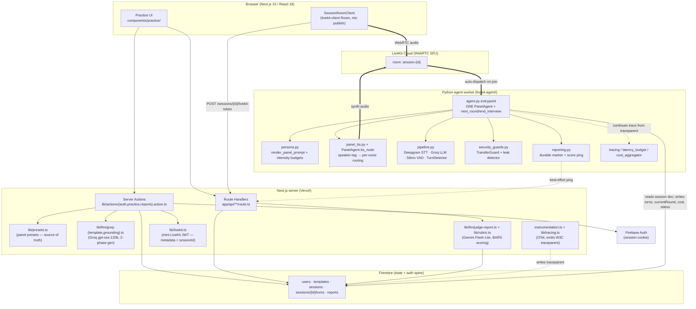

# ARCHITECTURE — JobVoice / Interview Assistant

> **Docs set:** [Index](README.md) · Architecture · [Tech Decisions](TECH_DECISIONS.md) · [Glossary](GLOSSARY.md) | deep dives: [security](security.md) · [observability](observability.md) · [resume](resumable-sessions.md)

> System design, component diagram, data flow, and the reasoning behind the
> structure. Every claim is anchored to a file you can open and verify. Paths are
> relative to the project root (`AI-Interviewer/interview-assistant/`).
>
> Where the code does **not** state a rationale, the inference is tagged **[ASSUMED]**.

---

## 1. What it is, in one sentence

A voice-driven panel-interview simulator: a candidate joins a WebRTC call and is
interviewed by **one AI agent roleplaying an N-person panel**, each panelist in
their own voice, with questions grounded in their CV + the job description, at a
pressure level the candidate picks — then a *different* model family scores the
transcript per round and answers "would this panel have advanced you?"

It is **two cooperating services around one database**, not a monolith:

1. **Next.js 15 app** — UI, auth, question generation, LiveKit token minting,
   scoring (this directory).
2. **Python LiveKit agent worker** — the voice pipeline (STT → LLM → TTS), the
   panel roleplay, the security guards (`livekit-agent/`).

Neither runs an interview alone. They communicate **only through Firestore
documents and a LiveKit room** — there is no direct Next.js → agent RPC, and no
HTTP client pointed at the agent anywhere in `lib/`. The one call in the other
direction (agent → `/api/internal/score`) is a best-effort *ping*, not a
dependency: see §6.

---

## 2. Component diagram

The top-level shape, matching the diagram in the root `README.md`:

```
┌─────────┐ WebRTC  ┌────────────┐  dispatch  ┌──────────────────────┐
│ Browser │ ───────▶│ LiveKit    │ ─────────▶ │  Python agent worker │
│ (Next)  │ ◀─────── │  Cloud SFU │ ◀──────── │  one PanelAgent,     │
└─────────┘  audio  └────────────┘   audio    │  N voices via        │
                                              │  tts_node routing    │
                                              └──────────┬───────────┘
     │                                                    │
     │                                    STT (Deepgram Nova-3)
     │                                    LLM (Groq gpt-oss-120b)
     │                                    TTS (ElevenLabs Flash v2.5)
     │                                    EOU (LiveKit audio TurnDetector)
     │                                                    │
     │                                        on call end │ marks awaiting-report
     │                                                    ▼
     │                                    ┌──────────────────────────┐
     │                                    │ Judge — Gemini Flash-Lite│
     │                                    │ per-round BARS scoring   │
     │                                    └──────────┬───────────────┘
     ▼                                               ▼
┌─────────────────────────────────────────────────────────────────────┐
│                    Firestore (sessions, turns, reports)             │
└─────────────────────────────────────────────────────────────────────┘
```

Expanded to the module level:



---

## 3. One user journey

There is exactly one flow: **self-practice**. A signed-in user picks a panel
preset, an intensity, a role/level/JD, and a CV; everything else follows.

| Route group | Path | What |
|---|---|---|
| `(auth)` | `/sign-in`, `/sign-up` | Firebase Auth → session cookie |
| `(root)` | `/` | Landing page |
| `(practice)` | `/practice` | Dashboard — history, bar-clearance, cumulative cost |
| `(practice)` | `/practice/new` | Preset + intensity + role/level/JD + CV → creates the session |
| `(practice)` | `/practice/settings` | The saved CV |
| `(practice)` | `/practice/[sessionId]/interview` | The LiveKit room |
| `(practice)` | `/practice/[sessionId]/report` | The bar verdict + per-round scores |

Practice mode is intentionally role-less: `createPracticeSession`
(`lib/actions/practice.action.ts`) does Phase-1 generation, creates the
template, Phase-2 grounds it against the CV, and writes the session — so the
practising user is simultaneously the template owner (`hrUid`) and the
`candidateUid`. Sessions are tagged `inviteToken: "practice"` as a sentinel the
dashboard filters on.

> **Historical note.** Earlier revisions of this doc described three journeys
> (self-practice, an HR template/invite flow, and a legacy single-agent flow)
> plus `invites`/`interviews`/`feedback` collections. All of that has been
> **deleted** — there is no `(hr)` or `(candidate)` route group, no
> `templates.action.ts` / `sessions.action.ts` / `general.action.ts`, and
> `firestore.rules` has no rule for those collections. `hrUid` on the template
> doc is the only surviving trace, and it now just means "who owns this template".

---

## 4. Data flow — lifecycle of one interview

```mermaid
sequenceDiagram
    participant B as Browser
    participant N as Next.js (server actions/API)
    participant F as Firestore
    participant LK as LiveKit Cloud
    participant A as Python agent

    B->>N: createPracticeSession (preset, intensity, role, level, JD, CV)
    N->>N: Phase 1 generateRoundQuestions (Groq, one call, round-keyed schema)
    N->>N: Phase 2 regroundRoundQuestions vs CV (skipped if CV is thin)
    N->>F: write sessions/{id} (panel spec, questionsByRound,<br/>traceparent, status=awaiting-call)
    B->>N: POST /sessions/{id}/livekit-token
    N-->>B: LiveKit JWT (metadata = {sessionId})
    B->>LK: room.connect(session-{id}) + publish mic
    LK->>A: auto-dispatch worker into the room
    A->>F: load session doc (CV, JD, panel, questionsByRound, traceparent)
    A->>A: build ONE PanelAgent; continue the OTel trace
    A->>F: status=in-call
    loop each turn
        B->>LK: candidate audio
        LK->>A: audio
        A->>A: Deepgram STT → TurnDetector → Groq (panel prompt)<br/>→ tts_node routes [TAG] runs to per-panelist voices
        A->>F: append sessions/{id}/turns/{index}<br/>(roundId, personaId, speakers, modelId, leakHits)
        A-->>LK: synth audio
        LK-->>B: audio + transcript
    end
    A->>A: next_round (guarded) → re-render prompt; end_interview (guarded)
    A->>F: estimatedCost, status=awaiting-report
    A->>N: POST /api/internal/score (best-effort ping)
    N->>F: read turns → judgeInterview (Gemini) → write reports/{id}, status=completed
    Note over N,F: cron /api/internal/reconcile sweeps anything the ping missed
    B->>N: view /practice/{id}/report
```

### Key non-obvious mechanics

- **No direct dispatch call.** The browser only joins the room; LiveKit Cloud
  auto-dispatches the registered worker when a participant arrives. The worker
  filters foreign rooms by name prefix — `_request_fnc` rejects anything not
  starting with `session-` (`agent.py`, `SESSION_ROOM_PREFIX` in
  `session_data.py`).
- **The session document is the contract.** Everything the agent needs — CV
  text, JD, the full panel spec, `questionsByRound`, candidate name, the OTel
  `traceparent`, and the resume cursor `currentRound` — is read from
  `sessions/{id}` at dispatch (`session_data.py::load_session_data`). The agent
  **never reads `lib/presets.ts`**: the panel spec is written verbatim onto the
  doc, so TypeScript stays the single source of truth and Python just parses.
- **Two write-sides, one Firestore.** Next.js writes via the Firebase Admin SDK
  (`firebase/admin.ts`); the agent writes via a service-account JSON. Both must
  target the same project.
- **Legacy session shapes still load.** `_parse_panel` accepts the old
  `questionsByPersona` + `currentPersonaId` shape and synthesizes the big-tech
  panel at calm intensity, so sessions created before presets still dispatch.

---

## 5. The panel (the heart of the system)

**One `Agent` subclass — `PanelAgent` — roleplays every interviewer**
(`agent.py`). This replaced a relay of three per-persona `Agent` subclasses; that
decision and why it was reversed are logged in
[`TECH_DECISIONS.md` §10](TECH_DECISIONS.md#10-superseded-decisions).

### 5.1 How N voices come out of one agent

The prompt (`persona.py::render_panel_prompt`) casts the LLM as the whole panel
and imposes a strict speaker protocol: every utterance must begin with a
roster tag, e.g. `[SARAH]`. The overridden **`PanelAgent.tts_node`** then does
the routing:

```python
# agent.py — PanelAgent.tts_node
pieces = split_speaker_segments(text, self._tag_to_persona, self.current_leader.id)
async for speaker, piece in pieces:
    if speaker != current:          # speaker changed → drain the old stream
        ...                         # and open the next panelist's TTS
        stream = self._tts_by_persona[speaker].stream()
    stream.push_text(piece)
```

Each panelist gets one prewarmed `elevenlabs.TTS` built from the spec on the
session doc (`_build_tts_for_spec`). The session itself has **no TTS** —
`build_session()` omits it deliberately (`pipeline.py`) — because `tts_node`
owns synthesis entirely. Draining sequentially on speaker change is fine:
audio must play in order anyway, and LLM text arrives far ahead of speech.

This is what a relay structurally could not do: interviewers who share the room,
interject, and build on each other — from one prompt, with less code.

**Tags are routing markup, and they are output-only** (`panel_tts.py`). The
candidate hears voices and never sees brackets; `naturalize_tags` rewrites
`[ADAM] …` to `Adam: …` before the turn is persisted, so the judge reads names
while the LLM's chat context keeps the raw tags it must keep emitting. Candidate
speech arrives via STT as plain text and is never tag-parsed — a spoken "bracket
Sarah bracket" cannot forge a speaker.

### 5.2 Rounds are prompt structure, not agents

`next_round` does **not** swap the Agent. It increments `_ACTIVE_ROUND`,
persists `currentRound`, and calls `update_instructions(self._render_prompt())`
— re-rendering the same prompt with a new current round. `end_interview` sets a
module-level `asyncio.Event` that the entrypoint watches in parallel with the
session task and closes the session on.

Both tools are gated by `TransferGuard` before they mutate anything (§6), and a
hard ceiling of 30 turns also trips the end flag.

### 5.3 Presets and intensity

| Preset (`lib/presets.ts`) | Rounds |
|---|---|
| `big-tech-swe` | behavioral (Sarah) → technical (Adam) → systemDesign (Bella) |
| `startup-generalist` | ownership (founder) → technical (senior-eng) |
| `new-grad-swe` | behavioral → fundamentals |

Intensity is a prompt-level **interjection budget** (`persona.py::INTENSITY_RULES`):

- **calm** — only the round leader speaks; others stay silent until their round.
- **standard** — leader drives; at most ONE interjection per round; no pile-ons.
- **grill** — up to THREE interjections per round; panelists may openly disagree
  with each other. Pressure comes **only** from the questions: never mock, never
  insult, never comment on nerves, tone, or delivery.

Budgets are prompt-enforced. An overrun is a quality bug (countable post-hoc
from turn metadata), never a runtime block — a hard interrupt mid-sentence would
be a worse artifact than an extra interjection.

### 5.4 Module-level state

`_PANEL_CONTEXT`, `_PANEL`, `_ACTIVE_ROUND`, `_GUARD`, `_END_INTERVIEW_FLAG`,
`_DB` bridge the entrypoint and the tool methods. This is safe **only because a
LiveKit worker forks a subprocess per job**, so each call gets its own module
instance; the entrypoint resets them at the top of every session. Documented at
`agent.py`'s module-state block, and a real trade-off — see `TECH_DECISIONS.md`.

---

## 6. The report path (it does not depend on the browser)

The report used to be triggered by the browser's `RoomEvent.Disconnected`
handler, which made a tab on a candidate's laptop the commit step for the
product's only real output. Close the lid and the interview simply never got
scored. Now (`reporting.py`, `app/api/internal/`):

1. **Durable marker first.** `mark_awaiting_report` writes
   `status="awaiting-report"` to Firestore. If everything after this line dies,
   the reconciler still knows a report is owed. This must not be skipped — so it
   runs in the entrypoint's `finally`, before the ping.
2. **Fast path.** `ping_score_endpoint` POSTs `/api/internal/score` so the report
   is usually ready by the time the browser lands on the report page. It is
   allowed to fail; failure costs latency, never correctness. Auth is a
   constant-time-compared bearer secret (`INTERNAL_API_SECRET`) — the caller is
   a worker process, not a user, so there is no session cookie.
3. **Reconciler.** `/api/internal/reconcile` runs on a daily Vercel cron
   (`vercel.json`) and sweeps two stale classes: `awaiting-report` older than
   2 min (the ping was lost) and `in-call` older than 30 min (the worker died
   mid-interview — no more audio is coming, so score the turns on disk). Capped
   at `MAX_PER_RUN = 2` reports per sweep so one tick can't blow the 60 s
   `maxDuration` ceiling; deeper backlogs drain across ticks. `generateReport`
   is idempotent, so a duplicate ping costs a Firestore read.

### The judge

`lib/llm/judge-report.ts`, on **Gemini Flash-Lite — a different model family
from the interviewer**, deliberately: if one model holds a wrong belief it will
both fail to probe a correct answer *and* mark it wrong when grading. The error
lives in the weights, so a fresh stateless call doesn't fix it; only a different
family does.

- **Segment.** `segmentByRound` splits the flat turn list using each turn's
  `roundId` (stamped by the PanelAgent), falling back to the legacy
  `personaId → round` map, then to the round in progress.
- **Score, 3× rotated.** Criterion **order alone** shifts LLM-judge scores by up
  to 0.8 points on a 5-point scale and flips the top-ranked candidate in 16–39%
  of cases — an enormous effect for something carrying zero information. So each
  transcript is scored `PERMUTATIONS = 3` times with the criteria **rotated**
  (not shuffled — rotation is deterministic, so reports are reproducible) and
  the **median** taken. The evidence and rationale shown are lifted from the run
  whose score is closest to the median, so the narrative matches the number.
  Per-criterion spread across runs is surfaced as `maxDisagreement` — high
  spread is displayed as low confidence rather than hidden.
- **Evidence before score.** The schema forces quote → rationale → score in that
  field order, because structured decoding fills fields in sequence. Empty
  evidence ⇒ score MUST be 0.
- **Verdict, separately.** A second call sees only the finished scores — never
  the raw transcript — and returns `barVerdict: advance | not-yet` plus the
  single highest-leverage focus area. It cannot anchor on the transcript, and an
  injection buried in candidate speech cannot reach it. `advance` requires
  overall ≥ 3.5 and no round below 2.5.

Weights live in `lib/rubric.ts` (per-round `ROUND_WEIGHTS` + `COMMUNICATION_WEIGHT`).

---

## 7. Security architecture (defense-in-depth, code-first)

The threat model is **prompt injection from the candidate** — the one untrusted
party who talks to the LLM, and whose CV is inlined into the system prompt. The
design principle, stated in code: *"The LLM can be talked out of any
instruction. The real defenses live HERE — code that runs either before the tool
mutates state (preconditions) or after the LLM produces text (leak detection)."*
(`security_guards.py`)

1. **Layer 1 — deterministic tool preconditions** (`TransferGuard`).
   `next_round` requires `MIN_USER_TURNS_BEFORE_TRANSFER = 2` user turns in the
   current round; `end_interview` requires `MIN_USER_TURNS_BEFORE_END = 6` total.
   On refusal the tool returns a plain refusal string and the round state is
   never touched.
2. **Layer 2 — post-hoc output-leak detection** (`detect_prompt_leak`). Compiled
   regexes scan every assistant turn for fragments of the rendered prompt; hits
   are logged at WARNING and tagged onto `metadata.security.leakHits`. It does
   not block — it surfaces drift loudly.
3. **Layer 3 — tags are output-only** (`panel_tts.py`), so the routing channel
   is not candidate-reachable.
4. **Layer 4 — a tight prompt integrity rule**, explicitly labelled
   belt-and-suspenders, not load-bearing (`persona.py::_INTEGRITY_RULE`).
5. **Layer 5 — the judge defends by structure**: delimit → neutralise the
   delimiter → schema-constrained decoding (`lib/llm/judge-report.ts`). This is
   the surface where an attack actually pays.
6. **Audit harness** — 54 cases across 10 categories, run at grill intensity
   against the *real* rendered prompt with declarative predicates, gated against
   a committed baseline (52 passing on gpt-oss-120b).

> An earlier design had an **ML input classifier (DeBERTa / llm-guard)** as
> Layer 1. It was **removed** (git `c6bfe0d`) in favour of the deterministic
> guards. The hot path carries no classifier.

Full write-up, including a known gap in the leak-pattern lists: `docs/security.md`.

---

## 8. Observability architecture (one trace, two processes)

A single OTel trace spans **Next.js server action → Firestore session doc →
Python agent worker**:

1. Next.js opens `practice.create-session` and writes the active **W3C
   `traceparent`** onto `sessions/{id}.traceparent` (`lib/tracing.ts` →
   `currentTraceparent()`, `instrumentation.ts`). Not the JWT; not room metadata.
2. The agent reads it and rehydrates the context, so `agent.panel-session`
   becomes a child of the Next-side span (`agent.py`, `tracing.py` →
   `context_from_traceparent`).

Two more subsystems run inside the agent:

- **Per-stage latency budgets** (p95): `eou_delay=300ms`, `llm_ttft=500ms`,
  `tts_ttfb=500ms`, `e2e_turn=1500ms`. Each assistant turn emits
  `agent.turn-latency`; partial turns are emitted too, tagged
  `latency.partial`, because dropping them biased p95 toward the healthy turns.
  EOU is **derived** (`e2e − llm_ttft − tts_ttfb`), not measured.
  (`latency_budget.py`, `metrics_bridge.py`)
- **Per-session cost telemetry** rolled up from provider usage and written to
  `sessions/{id}.estimatedCost` (`cost_aggregator.py`, `cost_rates.py`).

Full write-up: `docs/observability.md`.

---

## 9. Firestore as the data + authorization spine

All cross-service state lives in Firestore. Client reads are auth-checked by
ownership; **every write to a core collection goes through the Admin SDK**
(`allow write: if false`) — a candidate must never be able to write their own
score.

| Collection | Written by | Client read rule (`firestore.rules`) |
|---|---|---|
| `users/{uid}` | Next.js | owner only (`isOwner(uid)`) — read **and** write |
| `templates/{id}` | Next.js | owner of `hrUid` |
| `sessions/{id}` | Next.js + agent | `isOwner(candidateUid)`; `write: if false` |
| `sessions/{id}/turns/{i}` | **agent** | parent session's owner; `write: if false` |
| `reports/{sessionId}` | Next.js | parent session's owner; `write: if false` |

### Session status state machine

`awaiting-call → in-call → awaiting-report → completed`, with `reconnecting` and
`abandoned` referenced in `types/index.d.ts`. The agent flips `in-call` at start
and `awaiting-report` at teardown; Next.js flips `completed` when the report is
written. `load_session_data` accepts `awaiting-call`, `in-call`, and
`reconnecting` as callable states — `in-call` is exactly the resume case (the
tab closed mid-interview and the agent re-dispatches).

---

## 10. Why this structure (rationale)

| Decision | Rationale | Evidence |
|---|---|---|
| **Split Next.js app from Python agent** | The LiveKit Agents framework + the STT/LLM/TTS plugin ecosystem are Python-native, and the pipeline is a long-lived, stateful, audio-streaming process that cannot run in a serverless function. | `livekit-agent/` is a separate `uv` project (`pyproject.toml`) |
| **Firestore as the only cross-service channel** | Decouples the two services — no service discovery, no RPC, survives independent restarts. The agent is reachable purely via LiveKit dispatch + a doc read. | `agent.py` module docstring; no HTTP client to the agent in `lib/` |
| **Auto-dispatch via room-name convention** | Lets the browser start an interview without the Next.js server holding a connection to the agent; the worker self-selects rooms by `session-` prefix. | `agent.py::_request_fnc` |
| **One PanelAgent, not a relay** | Interjections and cross-talk are the product. A relay can only produce one voice at a time by construction, and cost more code to do less. | `agent.py::PanelAgent`, `panel_tts.py` |
| **Panel spec written onto the session doc** | `lib/presets.ts` stays the single source of truth; Python parses a doc instead of duplicating a preset library that would drift. | `practice.action.ts` step 5, `session_data.py::_parse_panel` |
| **Two-phase question generation** | Separates *what to ask for this role* from *how to phrase it for this candidate*. Phase 2 is skipped for thin CVs — a JD-grounded question beats one rewritten against 300 words, which fabricates specificity the interview then confidently probes. | `groq-template.ts`, `groq-grounding.ts`, `CV_TOKEN_FLOOR_CHARS` |
| **Judge on a different model family** | Correlated errors: one model both fails to probe a correct answer and marks it wrong. Scoring is offline, so the judge is chosen for reasoning quality, not speed. | `lib/judge.ts` |
| **Security in code, not prompt** | The candidate is the attacker and talks directly to the LLM; only code outside the LLM is non-bypassable. | `security_guards.py` |
| **Per-session subprocess + module globals** | LiveKit forks one subprocess per job, making module-level state effectively session-scoped and avoiding threading a context object through every tool. | `agent.py` module-state block |
| **Report driven by a durable marker, not a browser event** | The least reliable component in the system was the commit step for its only output. | `reporting.py`, `app/api/internal/reconcile` |
| **Firebase Auth + Firestore for the web tier** | **[ASSUMED]** — no rationale in code; consistent with optimizing for zero-ops auth + DB on a generous free tier. | (inference) |
| **Next.js App Router + Server Actions** | **[ASSUMED]** for the framework itself; the JWT-mint-as-server-action pattern is explicitly to keep the LiveKit secret off the client. | `ONBOARDING.md` §6 Conventions |

---

## 11. Repository map (verified)

```
interview-assistant/
├── app/
│   ├── (auth)/                 sign-in / sign-up
│   ├── (root)/                 landing page
│   ├── (practice)/practice/    dashboard, /new, /settings, [sessionId]/{interview,report}
│   └── api/
│       ├── practice/           cv, sessions
│       ├── sessions/[id]/livekit-token
│       └── internal/           score (agent-pinged) + reconcile (cron)
├── components/                 ui/ (shadcn) + practice/
├── lib/
│   ├── actions/                auth · practice · reports
│   ├── llm/                    groq-template · groq-grounding · judge-report · schema-retry
│   ├── presets.ts              the panel presets — the only config a user picks
│   ├── rubric.ts               BARS anchors per round type — the scoring contract
│   ├── clearance.ts            beat-the-panel progression
│   ├── judge.ts                judge model provider (Gemini)
│   ├── groq.ts                 interviewer model provider + multi-account failover
│   ├── livekit.ts              JWT minting (metadata = {sessionId})
│   ├── tracing.ts              OTel traced() + currentTraceparent()
│   └── cost-rates.ts           pricing (TS mirror of the Python file)
├── eval/                       question-gen regression harness + latency-report.ts
├── livekit-agent/              ── Python LiveKit Agents worker ──
│   ├── security_baseline.json  committed audit pass-set
│   └── src/interview_agent/
│       ├── agent.py            entrypoint + PanelAgent (tts_node, next_round, end_interview)
│       ├── panel_tts.py        speaker-tag parsing → per-voice routing
│       ├── persona.py          panel prompt, round rules, intensity budgets
│       ├── models.py           model ids — single source of truth
│       ├── pipeline.py         AgentSession factory + turn handling
│       ├── session_data.py     load session doc from Firestore
│       ├── reporting.py        durable marker + score ping
│       ├── security_guards.py  TransferGuard + detect_prompt_leak
│       ├── security/           injection_corpus.py (54) + runner.py + run_audit.py
│       ├── latency_budget.py   per-stage p95 budgets
│       ├── cost_aggregator.py + cost_rates.py  per-session spend
│       ├── tracing.py          OTel + W3C traceparent continuation
│       ├── metrics_bridge.py   per-turn latency span
│       └── persistence/        firestore.py (turns) + models.py (Turn dataclass)
├── firestore.rules             ownership rules; core-collection writes server-only
├── vercel.json                 daily reconciler cron
├── instrumentation.ts          Next.js OTel bootstrap
├── constants/index.ts          zod schemas (report, round gen/grounding, rubric)
├── types/                      index.d.ts + livekit.d.ts
└── docs/                       this set
```

---

## 12. Pointers to deeper docs

- Security threat model + defense layers + audit harness → `docs/security.md`
- OTel tracing + latency budgets + cost telemetry → `docs/observability.md`
- Mid-interview resume design → `docs/resumable-sessions.md`
- Decision rationale per library → `docs/TECH_DECISIONS.md`
- Term definitions → `docs/GLOSSARY.md`
- Original specs + plans (dated, historical) → `docs/superpowers/`
